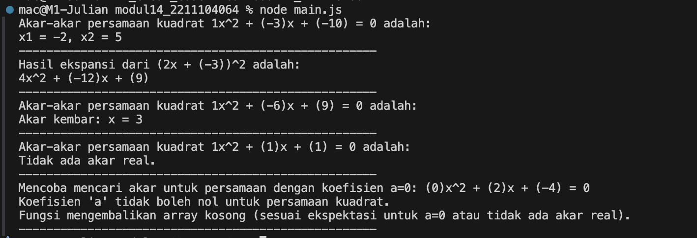

<h2>Nama : Dawnie Julian Nugroho</h2>
<h2>NIM: 2211104064</h2>
<h2>Kelas : SE-06-03</h2>

<h3>JURNAL Modul 14</h3>

### JURNAL

- Source Code main.js

```
// main.js

/**
 * @file Main script to demonstrate the usage of the aljabarLibraries module.
 * This script showcases examples for calculating quadratic roots and polynomial expansion.
 */

// Import functions from aljabarLibraries.
// Naming convention for imported functions (camelCase) matches the exported ones.
const { hitungAkarPersamaanKuadrat, hitungHasilKuadrat } = require('./aljabarLibraries');

// --- Example: Calculating Roots of a Quadratic Equation ---
// Equation: 1x^2 - 3x - 10 = 0
const koefisienKuadratUtama = [1, -3, -10];
const akarAkarPersamaan = hitungAkarPersamaanKuadrat(koefisienKuadratUtama);

console.log(`Akar-akar persamaan kuadrat ${koefisienKuadratUtama[0]}x^2 + (${koefisienKuadratUtama[1]})x + (${koefisienKuadratUtama[2]}) = 0 adalah:`);
if (akarAkarPersamaan.length === 0) {
    console.log("Tidak ada akar real atau input tidak valid (misal, a=0).");
} else if (akarAkarPersamaan.length === 1 || akarAkarPersamaan[0] === akarAkarPersamaan[1]) {
    // Handles cases with one distinct root (discriminant is zero)
    console.log(`Akar kembar: x = ${akarAkarPersamaan[0]}`);
} else {
    console.log(`x1 = ${akarAkarPersamaan[0]}, x2 = ${akarAkarPersamaan[1]}`);
}
console.log("----------------------------------------------------");

// --- Example: Expanding a Squared Binomial ---
// Expression: (2x - 3)^2 which is (2x + (-3))^2
const termBinomialKuadrat = [2, -3]; // Represents p=2, q=-3 in (px + q)^2
const hasilEkspansiKuadrat = hitungHasilKuadrat(termBinomialKuadrat);

console.log(`Hasil ekspansi dari (${termBinomialKuadrat[0]}x + (${termBinomialKuadrat[1]}))^2 adalah:`);
console.log(`${hasilEkspansiKuadrat[0]}x^2 + (${hasilEkspansiKuadrat[1]})x + (${hasilEkspansiKuadrat[2]})`);
console.log("----------------------------------------------------");

// --- Additional Example: Quadratic Equation with Double Root ---
// Equation: x^2 - 6x + 9 = 0 (roots: x=3)
const koefisienAkarKembar = [1, -6, 9];
const akarKembar = hitungAkarPersamaanKuadrat(koefisienAkarKembar);
console.log(`Akar-akar persamaan kuadrat ${koefisienAkarKembar[0]}x^2 + (${koefisienAkarKembar[1]})x + (${koefisienAkarKembar[2]}) = 0 adalah:`);
if (akarKembar.length === 0) {
    console.log("Tidak ada akar real atau input tidak valid.");
} else if (akarKembar.length === 1 || akarKembar[0] === akarKembar[1]) {
    console.log(`Akar kembar: x = ${akarKembar[0]}`);
} else {
    console.log(`x1 = ${akarKembar[0]}, x2 = ${akarKembar[1]}`);
}
console.log("----------------------------------------------------");

// --- Additional Example: Quadratic Equation with No Real Roots ---
// Equation: x^2 + x + 1 = 0
const koefisienTanpaAkar = [1, 1, 1];
const tanpaAkar = hitungAkarPersamaanKuadrat(koefisienTanpaAkar);
console.log(`Akar-akar persamaan kuadrat ${koefisienTanpaAkar[0]}x^2 + (${koefisienTanpaAkar[1]})x + (${koefisienTanpaAkar[2]}) = 0 adalah:`);
if (tanpaAkar.length === 0) {
    console.log("Tidak ada akar real.");
} else {
    // This case should ideally not be reached if logic for no real roots is correct
    console.log(`x1 = ${tanpaAkar[0]}, x2 = ${tanpaAkar[1]}`);
}
console.log("----------------------------------------------------");

// --- Additional Example: Case where 'a' coefficient is 0 ---
// Equation: 0x^2 + 2x - 4 = 0 (Linear equation: 2x - 4 = 0 => x = 2)
const koefisienANol = [0, 2, -4];
console.log(`Mencoba mencari akar untuk persamaan dengan koefisien a=0: (${koefisienANol[0]})x^2 + (${koefisienANol[1]})x + (${koefisienANol[2]}) = 0`);
const hasilPersamaanANol = hitungAkarPersamaanKuadrat(koefisienANol);
// Expecting an error message from the function and an empty array
if (hasilPersamaanANol.length === 0) {
    console.log("Fungsi mengembalikan array kosong (sesuai ekspektasi untuk a=0 atau tidak ada akar real).");
}
console.log("----------------------------------------------------");

```

- Source Code aljabarLibraries.js

```
// aljabarLibraries.js

/**
 * @file Library of algebraic functions.
 * @module aljabarLibraries
 */

/**
 * Calculates the real roots of a quadratic equation ax^2 + bx + c = 0.
 * Coefficients are provided as an array [a, b, c].
 * 'a' cannot be zero for a quadratic equation.
 * @param {number[]} coefficients - An array containing the coefficients [a, b, c].
 * @returns {number[]} An array containing the real roots, sorted in ascending order.
 * Returns an empty array if there are no real roots or if 'a' is zero.
 */
function hitungAkarPersamaanKuadrat(coefficients) {
    const [a, b, c] = coefficients;

    // Validate coefficient 'a'
    if (a === 0) {
        console.error("Koefisien 'a' tidak boleh nol untuk persamaan kuadrat.");
        return []; // Not a quadratic equation, or leads to division by zero
    }

    const diskriminan = (b * b) - (4 * a * c);

    if (diskriminan < 0) {
        return []; // No real roots
    }

    const akar1 = (-b + Math.sqrt(diskriminan)) / (2 * a);
    const akar2 = (-b - Math.sqrt(diskriminan)) / (2 * a);

    // Return sorted roots for consistency
    return [akar1, akar2].sort((x, y) => x - y);
}

/**
 * Calculates the coefficients of the expansion of (px + q)^2.
 * The expansion results in p^2x^2 + 2pqx + q^2.
 * Terms are provided as an array [p, q].
 * @param {number[]} terms - An array containing the terms [p, q] for the expression (px + q).
 * @returns {number[]} An array representing the coefficients of the expanded form: [p^2, 2pq, q^2].
 */
function hitungHasilKuadrat(terms) {
    const [p, q] = terms; // Using p, q for (px+q)^2 to distinguish from quadratic's a,b,c

    // Expansion: (px + q)^2 = p^2x^2 + 2pqx + q^2
    const koefisienPkuadrat = p * p;
    const koefisien2pq = 2 * p * q;
    const koefisienQkuadrat = q * q;

    return [koefisienPkuadrat, koefisien2pq, koefisienQkuadrat];
}

// Exporting the functions for use in other modules
module.exports = {
    hitungAkarPersamaanKuadrat,
    hitungHasilKuadrat,
};

```

- Berikut ini output code tersebut: <br>
  

- Refactoring dilakukan pada dua file JavaScript: aljabarLibraries.js (library fungsi) dan main.js (skrip utama untuk demonstrasi). Fokus refactoring adalah pada peningkatan keterbacaan, pemeliharaan, dan kesesuaian dengan standar kode yang baik, meliputi aspek-aspek yang disebutkan dalam tugas.
